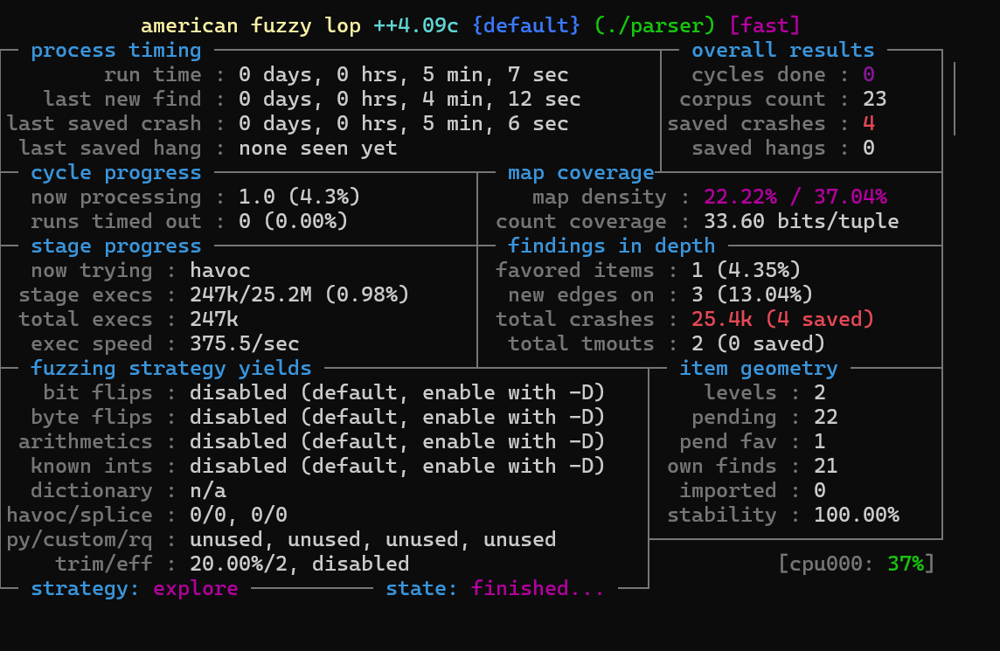
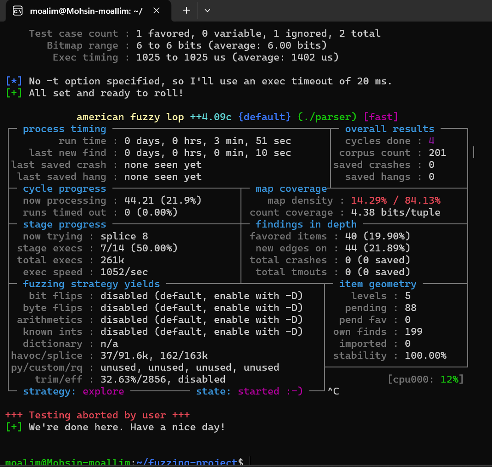

# AFL++ Parser Fuzzing (beginner project)

A small project to learn **coverage-guided fuzzing**. I wrote a tiny C program that parses `key=value` lines — a stand-in for any program that reads untrusted input, like the network data my undergraduate NIDS project parsed — then fuzzed it with **AFL++** until it crashed, read the crash report to find the bug, and fixed it.

## Tools
AFL++ (fuzzer) · AddressSanitizer (memory-error detector) · clang · Ubuntu (WSL2)

## The target
`parser.c` reads a file line by line and splits each `key=value` line into a key and a value. It copies the key into a fixed 16-byte buffer.

## Build and run
```
./build.sh      # AFL_USE_ASAN=1 afl-clang-fast -g -O1 parser.c -o parser
./run.sh        # afl-fuzz -i seeds -o out -m none -- ./parser @@
```

## What AFL++ found
Within a few minutes it saved **4 unique crashing inputs — all caused by the same bug**. Reproducing one of them, AddressSanitizer pointed straight to the broken line:

```
ERROR: AddressSanitizer: stack-buffer-overflow in parse_line parser.c:28
WRITE of size 1
  [32, 48) 'key' <== Memory access at offset 48 overflows this variable
SUMMARY: stack-buffer-overflow parser.c:28 in parse_line
```



**Root cause:** the loop that copies the key never checked its length, so a key of 16 or more characters wrote past the end of the 16-byte `key` buffer — a stack buffer overflow.

## The fix
One line — stop before the buffer is full (leaving room for the `\0` terminator):
```c
while (i < (int)sizeof(key) - 1 && line[i] != '=' && line[i] != '\0' && line[i] != '\n') {
```

After the fix I re-fuzzed from a clean start: **261,000 runs, 4 full cycles, 0 crashes.**



## What I learned
AFL++ found a bug in minutes that I would not have found by reading the code myself. AddressSanitizer took me straight to the broken line, and the fix was a single missing length check — a clear lesson in how easily unchecked input causes memory bugs in C, and that reading the crash report is as much of the work as finding the crash.

## Files
- `parser.c` — the target (contains the bug)
- `parser_fixed.c` — the fixed version
- `seeds/` — starting inputs for the fuzzer
- `build.sh`, `run.sh`, `reproduce.sh` — build / fuzz / reproduce a crash
